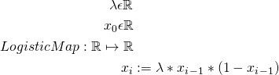
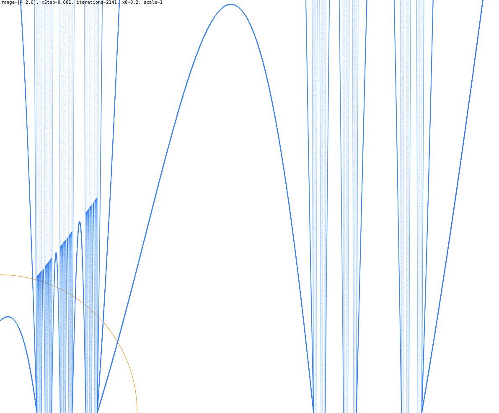
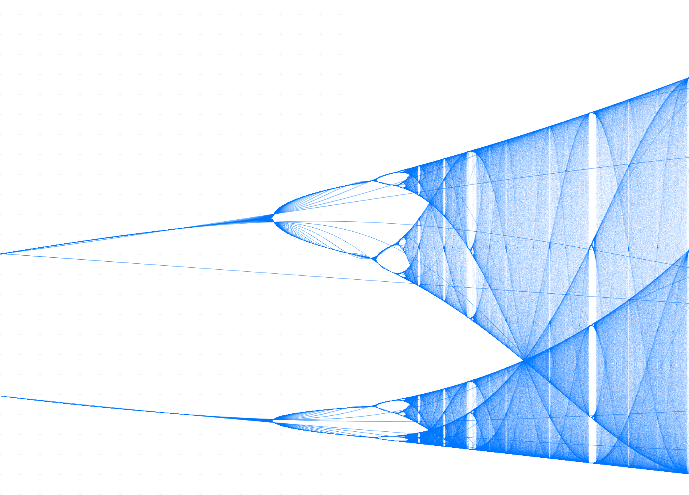
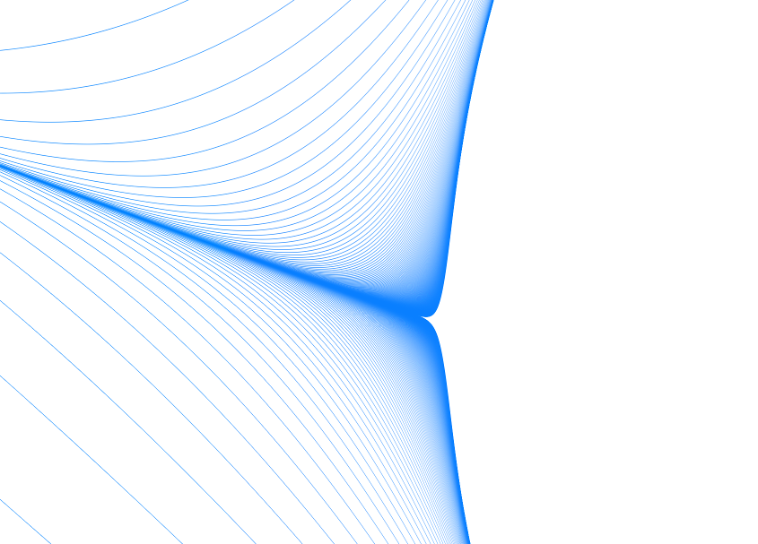
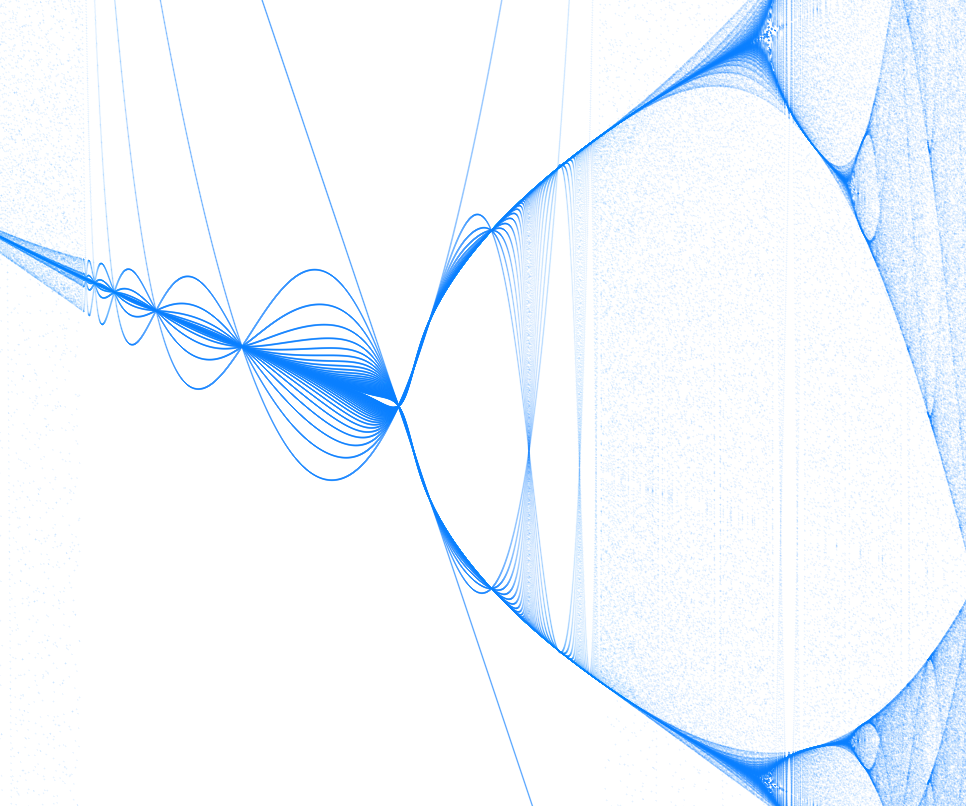

# Feigenbaum bifurcation plot

The logistic map

when plotted gives a peek into deterministic chaos. Whilst lambda resides inside the range ~[0..3.2] everthing
seems fine and the recursive definition of the function gives (more or less) convergent series, the situation
changes for values beyond ~3.2, and for values larger than 3.6 the result becomes (pseudo) chaotic, als the
number of accumulation points increases.

Numberphile postet a really nice video about this function/map and the two Feigenbaum constants ...
for those who are new to this topic:
https://www.youtube.com/watch?v=ETrYE4MdoLQ

First attempt to visualize a fraction of the feigenbaum diagram

Feigenbaum bifurcation (logistic map)

Closer look into a bifurcation point near [3.563,3.6]

Zoom in a little bit more into [3.563,3.6]

I made a high resultion plot (13776x924 pixels) which took my machine about an hour to compute.

[Download Hi-Res plot here](https://www.int2byte.de/public/feigenbaum-plot/screenshots/screenshot-feigenbaum-2018-12-12-4-x8.png "Feigenbaum bifurcation live demo")

This file is about 40MB large:
 * plot range [3.2 to 3.83]
 * 500 iterations per sample
 * sample size 0.1 (10 samples per pixel, makes 137.760 samples for lambda)
 * plot (y axis) is scaled up from [0,1]
 * x(0) is 0.2 (this value does not seem to have any affect at all after some iterations)

[Find a live demo here](https://www.int2byte.de/public/feigenbaum-plot/main-feigenbaum.html "Feigenbaum bifurcation live demo") (better have a quick machine)

### Changelog
* 2018-12-30
  * Added a rectangular selector tool (to select sub plot areas).
* 2018-12-29
  * y was plotted inverted.
* 2018-12-28
  * Removed the 'plotScale' param (in favour of 'normalizeToMin' and 'normalizeToMax').
  * Added the balanced binary tree collection to increase performance.
* 2018-12-22
  * Added some equations.
* 2018-12-11
  * Replaced the plotting engine by the PlotBoilerplate.
  * Calculated the first hi-res plot <3
* 2018-10-23
  * Init

###
Dependencies
* HTML5 Canvas
* HTML5 WebGL
* PlotBoilerplate.js

### Credits
 * Pavel Holoborodko fot the QuickLATEX tool for rendering equations https://www.quicklatex.com/